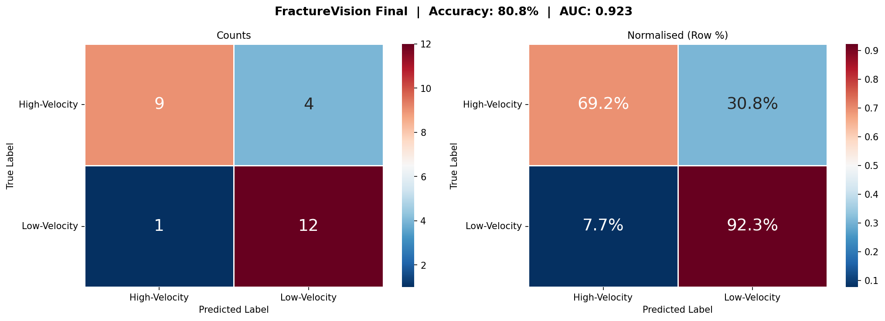
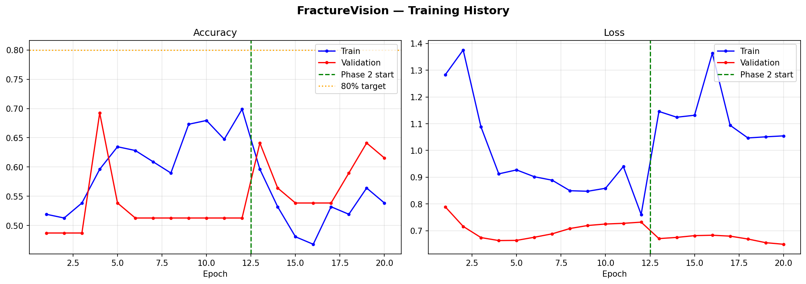
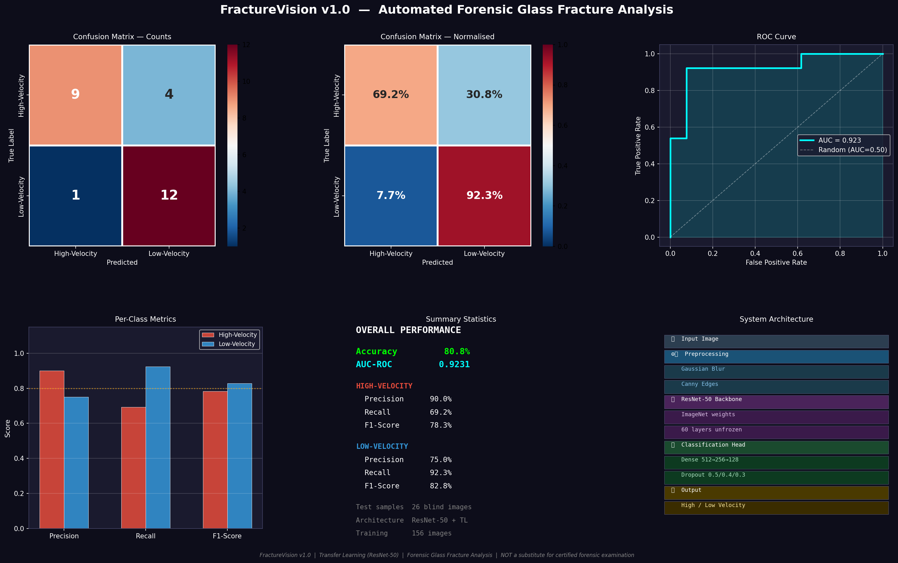
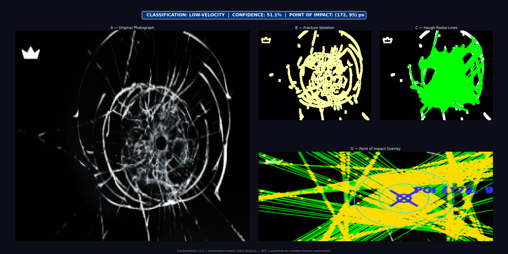

#  FractureVision

An AI-powered forensic glass fracture analysis system that classifies glass impact types and estimates the Point of Impact (POI) using Deep Learning and Computer Vision.

---

##  Overview

FractureVision was developed as a Digital Forensics semester project.

The system assists forensic investigations by:

- Classifying glass fractures into High Velocity and Low Velocity impacts
- Estimating the Point of Impact (POI)
- Automating forensic glass fracture analysis
- Reducing manual analysis time

---

##   Features

- Deep Learning-based classification
- Point of Impact localization
- Image preprocessing pipeline
- ResNet-50 Transfer Learning
- Computer Vision analysis
- Automated forensic decision support

---

##  Technologies Used

- Python
- TensorFlow / Keras
- OpenCV
- NumPy
- Scikit-learn
- Matplotlib

---

##   Results

- Accuracy: **80.8%**
- AUC-ROC: **0.923**
- High Velocity Precision: **90%**
- Low Velocity Recall: **92.3%**
- ##  Project Screenshots

### Confusion Matrix



### Training Curves



### Project Poster



### Point of Impact Report



---

##   Project Structure

```
FractureVision
│
├── Documentation
├── Demo
├── Images
└── Source_Code
```

---

##   Documentation

The repository includes:

- IEEE Paper
- Project Presentation
- Evaluation Report

---

##   Academic Project

Developed as part of the Digital Forensics course.
